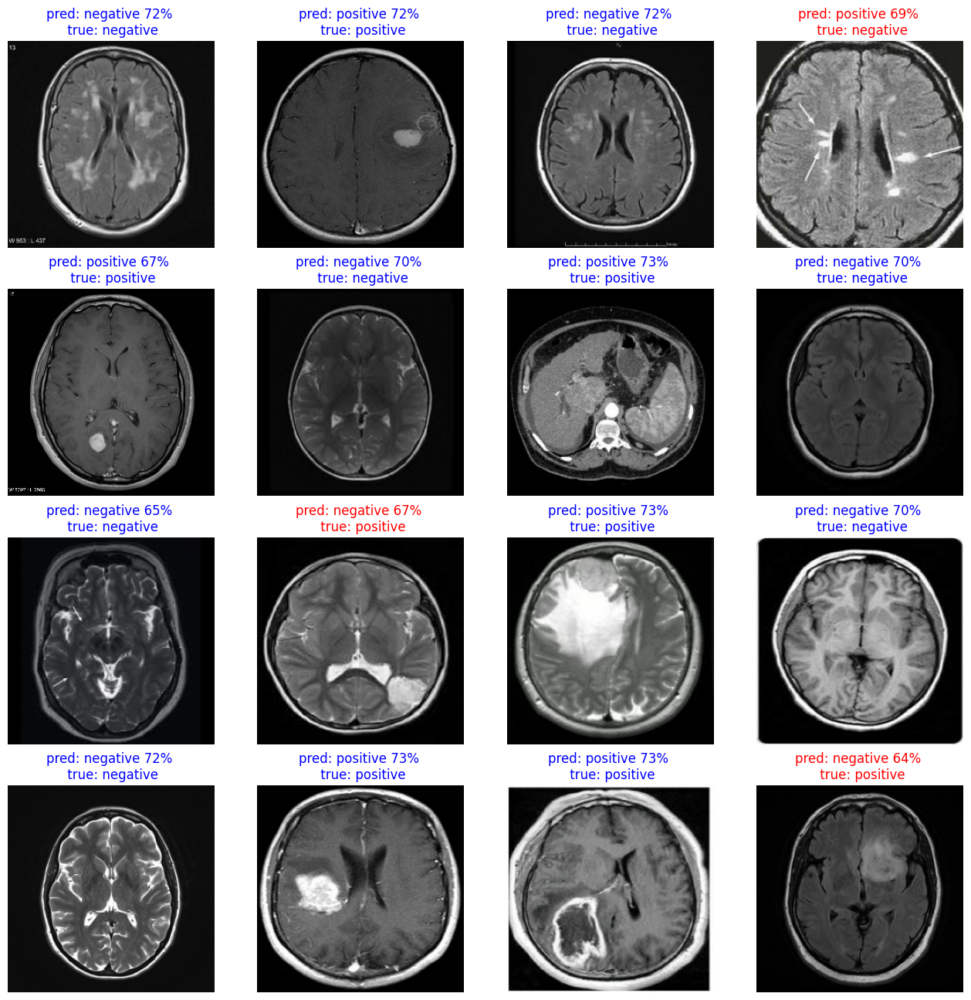

# Brain Tumor Classification with EfficientNetB0

Binary classification of brain MRI slices (**tumor / no tumor**) using transfer
learning and fine-tuning of a pretrained EfficientNetB0 in TensorFlow/Keras.
The training workflow lives in [`train.ipynb`](train.ipynb) and relies on a small
helper module, `S3_package_for_subArticle`.

> **Research and educational use only.** This model is not a medical device and
> must not be used for diagnosis or any clinical decision.

## Results

| Stage | Train accuracy | Validation accuracy | Validation loss |
|---|---|---|---|
| Feature extraction (10 epochs, frozen base) | 81.1% | 67.7% | 0.602 |
| Fine-tuning (epochs 10 to 29) | 82.9% | 73.3% (best 73.8%) | 0.506 |

**Held-out test set (36 images):** accuracy **91.67%** (33/36), loss 0.209.



*16 test images: title shows predicted class and confidence; red titles are
errors (3 of 16 here: one false positive, two false negatives).*

Read these numbers with care:

- The test set is tiny. 33/36 correct has a 95% Wilson interval of roughly
  **78% to 97%**, so it is not strong evidence of 92% generalisation.
- Validation accuracy (about 73%) is well below test accuracy (about 92%). Both
  sets are small and the validation set is augmented, so the gap is likely
  noise and split differences rather than a real difference in quality.
- Prediction confidences in the sample are low (64% to 73%), so the model is
  not very decisive.
- Both error types matter for a screening-style task; a confusion matrix,
  sensitivity and specificity should be reported before drawing conclusions.

## Data

| Split | Images |
|---|---|
| Train | 948 |
| Validation (after augmentation) | 374 |
| Test | 36 |

Two classes (negative / positive), loaded with `prepare_flow_from_dir_dataset("brain")`
from a directory named `brain`. The validation split is expanded with
`generate_augmented_dataset("brain\\val", 10, 240)`, which ran 10 augmentation
passes over the validation folder.

Expected layout (adjust to match your copy of the dataset):

```
brain/
  train/{negative,positive}/
  val/{negative,positive}/
  test/{negative,positive}/
```

<!-- TODO: add dataset name, source/URL, license and citation. -->

## Method

1. **Augment** the validation set (`generate_augmented_dataset`).
2. **Load** train / test / validation datasets (`prepare_flow_from_dir_dataset`).
3. **Train** with `buildEfficientB0_Model(train, valid, 2, 10, 20)`:
   - *Feature extraction:* pretrained EfficientNetB0 as a frozen backbone with a
     new 2-class head, 10 epochs.
   - *Fine-tuning:* unfreeze the backbone and train for 20 more epochs
     (log epochs 10 to 29).
4. **Evaluate** on the test set with `evaluate_model`.
5. **Inspect predictions** visually with `evaluate_and_predict` (pass `16` for a
   4x4 grid, `1` for a single image).

The final model is saved to
`buildEfficientB0_Model/trained_model_finetuned.keras`.

## Getting started

Environment used: Python 3.12 in a dedicated virtual environment, TensorFlow/Keras 3
(`.keras` model format).

```bash
python -m venv .venv
source .venv/bin/activate        # Windows: .venv\Scripts\activate
pip install tensorflow numpy matplotlib tqdm jupyter
jupyter notebook train.ipynb
```

Run the cells top to bottom:

```python
from S3_package_for_subArticle import *

generate_augmented_dataset("brain\\val", 10, 240)
train_dataset, test_dataset, valid_dataset = prepare_flow_from_dir_dataset("brain")
base_model_fine, model_fine, history_fine = buildEfficientB0_Model(train_dataset, valid_dataset, 2, 10, 20)

eval = evaluate_model(test_dataset, "buildEfficientB0_Model/trained_model_finetuned.keras")
evaluate_and_predict(test_dataset, "buildEfficientB0_Model/trained_model_finetuned.keras", 16)
```

Load the trained model for inference:

```python
import tensorflow as tf
model = tf.keras.models.load_model("buildEfficientB0_Model/trained_model_finetuned.keras")
```

## Project structure

```
.
├── train.ipynb                      # training + evaluation workflow
├── S3_package_for_subArticle.py     # helper functions used by the notebook
├── brain/                           # dataset (train / val / test)
├── buildEfficientB0_Model/
│   └── trained_model_finetuned.keras
└── assets/sample_predictions.png
```

## Serving the model

To use this model behind a FastAPI/PostgreSQL service, make sure inference
matches training exactly: image size, channel order (Keras uses NHWC), and
pixel scaling (Keras EfficientNet models normally expect raw 0 to 255 inputs
unless preprocessing was added in the pipeline). Verify against the helper
module before exporting, for example with `tf2onnx`.

## Limitations and next steps

- Enlarge the test set and report a confusion matrix, precision/recall, ROC-AUC.
- Split by **patient**, not by image, to avoid leakage between train and test.
- Augment the training set too, and try class weighting if classes are imbalanced.
- Add explainability (e.g. Grad-CAM) so predictions can be sanity-checked.
- Validate on external data from other scanners and sequences (the samples mix
  T1, T2 and FLAIR, and include at least one non-brain slice).

## Author

Michael Ohaya
